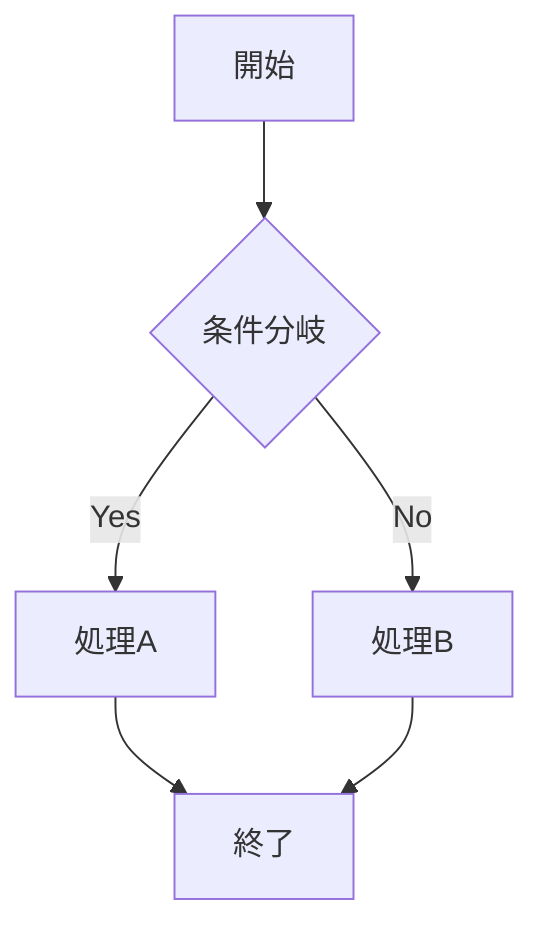
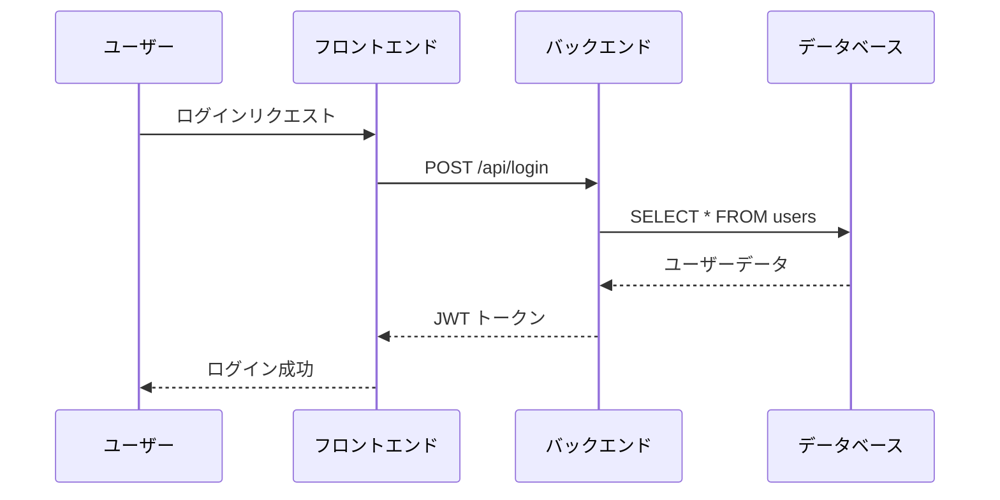
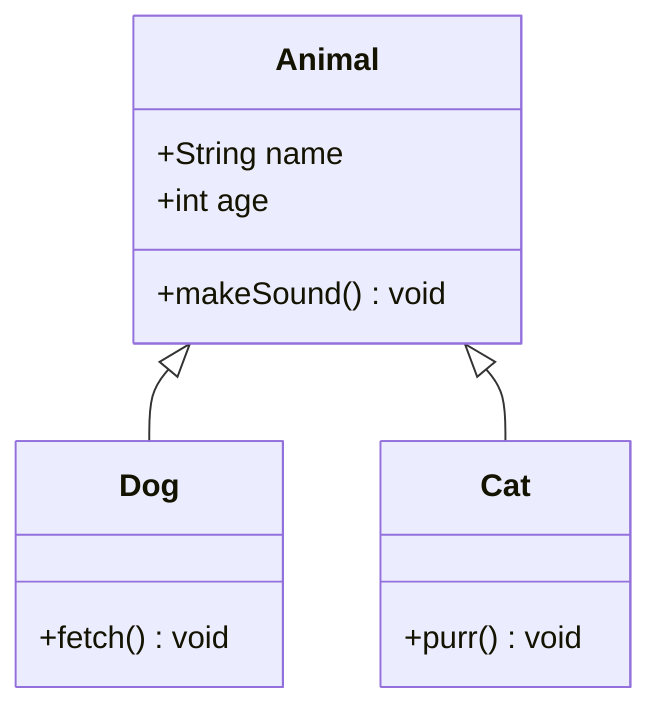
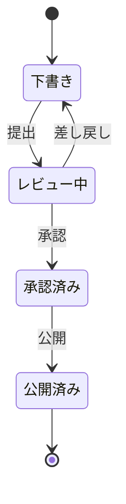
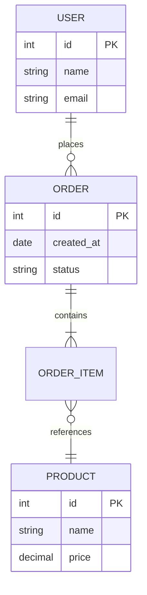
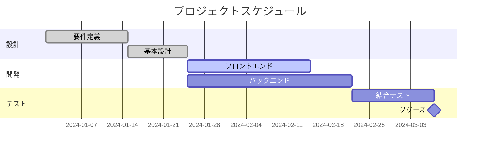
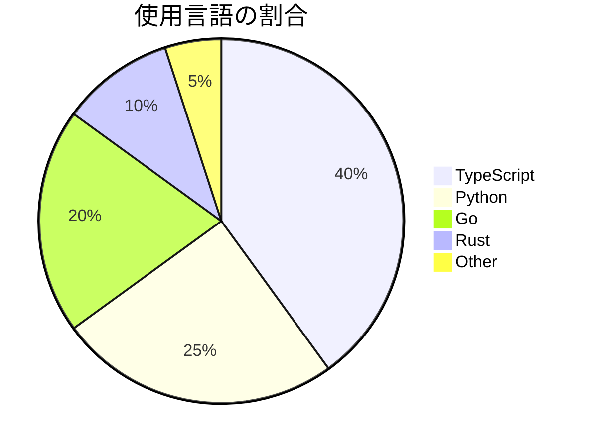
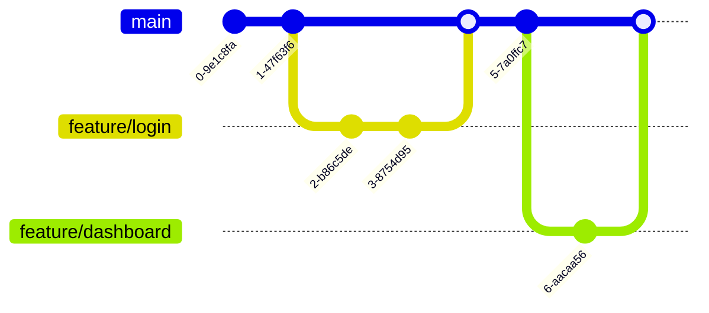
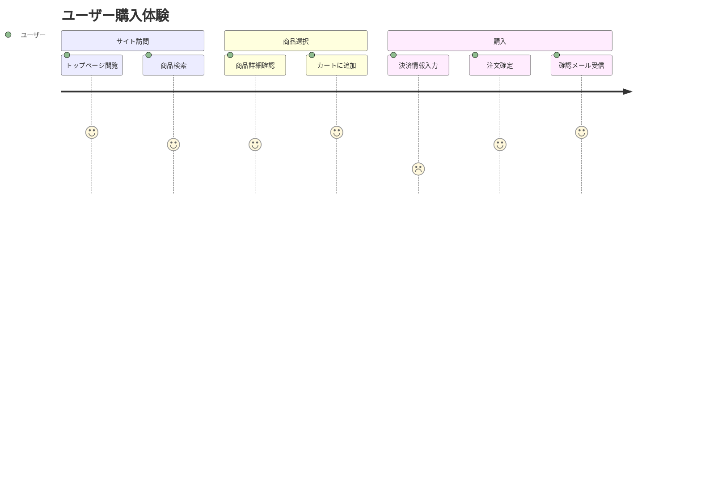
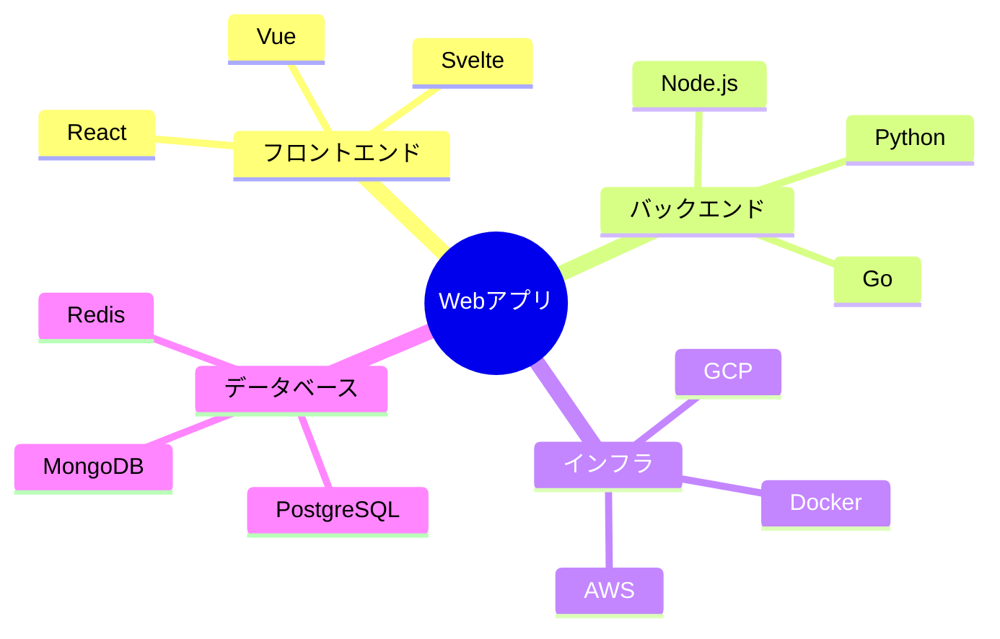

# GitHub Markdown 完全ガイド — プレビュー対応形式サンプル集

GitHubでプレビュー可能なMarkdownの全機能を、実際のサンプル付きで網羅的にまとめたドキュメントです。

---

## 目次

- [1. 基本Markdown](#1-基本markdown)
- [2. GFM拡張機能](#2-gfmgithub-flavored-markdown拡張機能)
- [3. Mermaidダイアグラム](#3-mermaidダイアグラム)
- [4. 数式（LaTeX / MathJax）](#4-数式latex--mathjax)
- [5. GeoJSON / TopoJSON](#5-geojson--topojson)
- [6. STL 3Dレンダリング](#6-stl-3dレンダリング)
- [7. アラート（Alerts）](#7-アラートalerts)
- [8. 脚注（Footnotes）](#8-脚注footnotes)
- [9. 折りたたみセクション](#9-折りたたみセクション)
- [10. その他の機能](#10-その他の機能)
- [対応場所まとめ](#対応場所まとめ)

---

## 1. 基本Markdown

### 1.1 見出し

# 見出し1
## 見出し2
### 見出し3
#### 見出し4
##### 見出し5
###### 見出し6

### 1.2 テキストスタイリング

| スタイル | 構文 | 表示 |
|---------|------|------|
| 太字 | `**太字**` | **太字** |
| 斜体 | `*斜体*` | *斜体* |
| 太字+斜体 | `***太字斜体***` | ***太字斜体*** |
| 取り消し線 | `~~取り消し~~` | ~~取り消し~~ |
| 下付き文字 | `H<sub>2</sub>O` | H<sub>2</sub>O |
| 上付き文字 | `X<sup>2</sup>` | X<sup>2</sup> |
| 下線 | `<ins>下線</ins>` | <ins>下線</ins> |

### 1.3 引用

> これは引用ブロックです。
> 複数行にまたがることができます。
>
> > ネストされた引用も可能です。

### 1.4 コード

インラインコード: `console.log("Hello")` のように記述します。

コードブロック（シンタックスハイライト付き）:

```python
def fibonacci(n):
    """フィボナッチ数列を生成する"""
    a, b = 0, 1
    for _ in range(n):
        yield a
        a, b = b, a + b

for num in fibonacci(10):
    print(num)
```

```javascript
// JavaScriptのサンプル
const fetchData = async (url) => {
  const response = await fetch(url);
  return response.json();
};
```

```bash
# シェルスクリプトのサンプル
echo "Hello, GitHub Markdown!"
ls -la | grep ".md"
```

diff表示:

```diff
- 削除された行
+ 追加された行
  変更のない行
```

### 1.5 リンク

- 通常のリンク: [GitHub](https://github.com)
- タイトル付きリンク: [GitHub](https://github.com "GitHubのホームページ")
- 相対リンク: [READMEへ](../README.md)
- URLの自動リンク: https://github.com

### 1.6 画像


ダーク/ライトモード対応画像:

```html
<picture>
  <source media="(prefers-color-scheme: dark)" srcset="dark-image.png">
  <source media="(prefers-color-scheme: light)" srcset="light-image.png">
  
</picture>
```

### 1.7 リスト

**順序なしリスト:**

- 項目1
  - ネスト項目A
  - ネスト項目B
    - さらにネスト
- 項目2
- 項目3

**順序付きリスト:**

1. 最初の手順
2. 次の手順
   1. サブステップA
   2. サブステップB
3. 最後の手順

### 1.8 水平線

---

### 1.9 HTMLコメント（非表示）

<!-- このテキストはレンダリングされません。レビュアーへのメモなどに使えます。 -->

↑ この上に非表示のコメントがあります（ソースを見てください）。

---

## 2. GFM（GitHub Flavored Markdown）拡張機能

### 2.1 テーブル

| 左揃え | 中央揃え | 右揃え |
| :--- | :---: | ---: |
| データ1 | データ2 | 100 |
| **太字**も使える | `コード`も使える | 2,500 |
| [リンク](https://github.com) | *斜体*も可 | 99,999 |

### 2.2 タスクリスト

- [x] リポジトリを作成する
- [x] READMEを追加する
- [ ] ドキュメントを整備する
- [ ] テストを書く
  - [x] ユニットテスト
  - [ ] 統合テスト

### 2.3 メンション・参照

- ユーザーメンション: `@username`
- チームメンション: `@org/team-name`
- Issue参照: `#123`
- クロスリポジトリ参照: `owner/repo#456`

### 2.4 絵文字

:wave: :rocket: :star: :bug: :white_check_mark: :warning: :memo: :bulb: :heart: :+1:

---

## 3. Mermaidダイアグラム

### 3.1 フローチャート



### 3.2 シーケンス図



### 3.3 クラス図



### 3.4 状態図



### 3.5 ER図



### 3.6 ガントチャート



### 3.7 円グラフ



### 3.8 Gitグラフ



### 3.9 ユーザージャーニー



### 3.10 マインドマップ



---

## 4. 数式（LaTeX / MathJax）

### 4.1 インライン数式

アインシュタインの公式 $E = mc^2$ は物理学の基礎です。

二次方程式の解は $x = \frac{-b \pm \sqrt{b^2 - 4ac}}{2a}$ で求められます。

### 4.2 ブロック数式

$$
\sum_{n=1}^{\infty} \frac{1}{n^2} = \frac{\pi^2}{6}
$$

$$
\begin{aligned}
\nabla \times \vec{E} &= -\frac{\partial \vec{B}}{\partial t} \\
\nabla \times \vec{B} &= \mu_0 \vec{J} + \mu_0 \epsilon_0 \frac{\partial \vec{E}}{\partial t}
\end{aligned}
$$

### 4.3 mathコードブロック

```math
\int_{-\infty}^{\infty} e^{-x^2} dx = \sqrt{\pi}
```

```math
\begin{pmatrix}
a & b \\
c & d
\end{pmatrix}
\begin{pmatrix}
x \\
y
\end{pmatrix}
=
\begin{pmatrix}
ax + by \\
cx + dy
\end{pmatrix}
```

---

## 5. GeoJSON / TopoJSON

### 5.1 GeoJSON（地図表示）

```geojson
{
  "type": "FeatureCollection",
  "features": [
    {
      "type": "Feature",
      "geometry": {
        "type": "Point",
        "coordinates": [139.6917, 35.6895]
      },
      "properties": {
        "name": "東京",
        "population": "14,000,000"
      }
    },
    {
      "type": "Feature",
      "geometry": {
        "type": "Point",
        "coordinates": [135.5023, 34.6937]
      },
      "properties": {
        "name": "大阪",
        "population": "2,750,000"
      }
    },
    {
      "type": "Feature",
      "geometry": {
        "type": "LineString",
        "coordinates": [
          [139.6917, 35.6895],
          [137.0, 35.0],
          [135.5023, 34.6937]
        ]
      },
      "properties": {
        "name": "東京-大阪ルート"
      }
    }
  ]
}
```

### 5.2 TopoJSON

```topojson
{
  "type": "Topology",
  "objects": {
    "example": {
      "type": "GeometryCollection",
      "geometries": [
        {
          "type": "Point",
          "coordinates": [0, 0],
          "properties": {
            "name": "原点"
          }
        }
      ]
    }
  },
  "arcs": []
}
```

---

## 6. STL 3Dレンダリング

```stl
solid cube
  facet normal 0 0 -1
    outer loop
      vertex 0 0 0
      vertex 1 0 0
      vertex 1 1 0
    endloop
  endfacet
  facet normal 0 0 -1
    outer loop
      vertex 0 0 0
      vertex 1 1 0
      vertex 0 1 0
    endloop
  endfacet
  facet normal 0 0 1
    outer loop
      vertex 0 0 1
      vertex 1 1 1
      vertex 1 0 1
    endloop
  endfacet
  facet normal 0 0 1
    outer loop
      vertex 0 0 1
      vertex 0 1 1
      vertex 1 1 1
    endloop
  endfacet
  facet normal 0 -1 0
    outer loop
      vertex 0 0 0
      vertex 1 0 1
      vertex 1 0 0
    endloop
  endfacet
  facet normal 0 -1 0
    outer loop
      vertex 0 0 0
      vertex 0 0 1
      vertex 1 0 1
    endloop
  endfacet
  facet normal 1 0 0
    outer loop
      vertex 1 0 0
      vertex 1 0 1
      vertex 1 1 1
    endloop
  endfacet
  facet normal 1 0 0
    outer loop
      vertex 1 0 0
      vertex 1 1 1
      vertex 1 1 0
    endloop
  endfacet
  facet normal 0 1 0
    outer loop
      vertex 0 1 0
      vertex 1 1 0
      vertex 1 1 1
    endloop
  endfacet
  facet normal 0 1 0
    outer loop
      vertex 0 1 0
      vertex 1 1 1
      vertex 0 1 1
    endloop
  endfacet
  facet normal -1 0 0
    outer loop
      vertex 0 0 0
      vertex 0 1 0
      vertex 0 1 1
    endloop
  endfacet
  facet normal -1 0 0
    outer loop
      vertex 0 0 0
      vertex 0 1 1
      vertex 0 0 1
    endloop
  endfacet
endsolid cube
```

> インタラクティブに回転・ズーム可能な3Dキューブが表示されます（10MB制限、ASCII STLのみ対応）。

---

## 7. アラート（Alerts）

> [!NOTE]
> これは **NOTE** アラートです。ユーザーが流し読みしても知っておくべき補足情報を記載します。

> [!TIP]
> これは **TIP** アラートです。より効率的に作業するためのアドバイスを記載します。

> [!IMPORTANT]
> これは **IMPORTANT** アラートです。目標達成に必要な重要情報を記載します。

> [!WARNING]
> これは **WARNING** アラートです。注意を要する緊急情報を記載します。

> [!CAUTION]
> これは **CAUTION** アラートです。特定の操作によるリスクや悪影響について注意喚起します。

---

## 8. 脚注（Footnotes）

GitHub Markdownは脚注をサポートしています[^1]。脚注は文末に自動的にレンダリングされます。

名前付きの脚注も使用可能です[^gfm-spec]。複数行の脚注も作成できます[^multiline]。

[^1]: これは番号付きの脚注です。
[^gfm-spec]: GitHub Flavored Markdown Specに基づいて実装されています。
[^multiline]: これは複数行の脚注です。
  2行目以降は2スペースでインデントします。
  3行目も同様です。

---

## 9. 折りたたみセクション

<details>
<summary>クリックして展開：基本的な折りたたみ</summary>

ここに折りたたまれたコンテンツが表示されます。

**Markdownの書式**も使えます:
- リスト項目1
- リスト項目2

```python
print("コードブロックも折りたたみの中で使えます")
```

</details>

<details>
<summary>クリックして展開：ネストされた折りたたみ</summary>

外側の折りたたみコンテンツです。

<details>
<summary>さらに内側の折りたたみ</summary>

ネストされた折りたたみも動作します。

</details>

</details>

<details open>
<summary>初期状態で展開済みのセクション</summary>

`open` 属性を付けると、最初から展開された状態で表示されます。

</details>

---

## 10. その他の機能

### 10.1 カラープレビュー

Issue、PR、Discussionsのコメントでは、以下のカラーコードがプレビュー表示されます:

- HEX: `#0969DA`
- RGB: `rgb(9, 105, 218)`
- HSL: `hsl(212, 92%, 45%)`

> **注意:** `.md` ファイルではカラープレビューは表示されません。Issue/PR/Discussionsのみ対応です。

### 10.2 diff表示（コードブロック）

```diff
@@ -1,4 +1,4 @@
 function greet(name) {
-  console.log("Hello, " + name);
+  console.log(`Hello, ${name}!`);
   return true;
 }
```

### 10.3 キーボードキー表示

<kbd>Ctrl</kbd> + <kbd>C</kbd> でコピー、<kbd>Ctrl</kbd> + <kbd>V</kbd> でペーストします。

### 10.4 定義リスト（HTMLタグ）

<dl>
  <dt>Markdown</dt>
  <dd>軽量マークアップ言語。プレーンテキストから構造化ドキュメントを生成する。</dd>
  <dt>GFM</dt>
  <dd>GitHub Flavored Markdown。GitHubが拡張したMarkdown方言。</dd>
</dl>

### 10.5 画像のサイズ指定（HTMLタグ）

```html

```


### 10.6 テーブル内の改行

| 項目 | 説明 |
|------|------|
| 改行あり | 1行目<br>2行目<br>3行目 |
| リスト風 | ・項目A<br>・項目B |

### 10.7 アンカーリンク（ページ内リンク）

見出しには自動的にアンカーが生成されます。[目次に戻る](#目次) のようにリンクできます。

ルール:
- 小文字に変換
- スペースは `-` に変換
- 記号は除去
- 重複する見出しは末尾に `-1`, `-2` が付与

---

## 対応場所まとめ

| 機能 | .mdファイル | Issue | PR | Comment | Wiki | Discussions |
|------|:-----------:|:-----:|:--:|:-------:|:----:|:-----------:|
| 基本Markdown | :white_check_mark: | :white_check_mark: | :white_check_mark: | :white_check_mark: | :white_check_mark: | :white_check_mark: |
| テーブル | :white_check_mark: | :white_check_mark: | :white_check_mark: | :white_check_mark: | :white_check_mark: | :white_check_mark: |
| タスクリスト | :white_check_mark: | :white_check_mark: | :white_check_mark: | :white_check_mark: | :white_check_mark: | :white_check_mark: |
| Mermaid | :white_check_mark: | :white_check_mark: | :white_check_mark: | :white_check_mark: | :white_check_mark: | :white_check_mark: |
| 数式 | :white_check_mark: | :white_check_mark: | :white_check_mark: | :white_check_mark: | :white_check_mark: | :white_check_mark: |
| GeoJSON/TopoJSON | :white_check_mark: | :white_check_mark: | :white_check_mark: | :white_check_mark: | :white_check_mark: | :white_check_mark: |
| STL 3D | :white_check_mark: | :white_check_mark: | :white_check_mark: | :white_check_mark: | :white_check_mark: | :white_check_mark: |
| アラート | :white_check_mark: | :white_check_mark: | :white_check_mark: | :white_check_mark: | :white_check_mark: | :white_check_mark: |
| 脚注 | :white_check_mark: | :white_check_mark: | :white_check_mark: | :white_check_mark: | :white_check_mark: | :white_check_mark: |
| 折りたたみ | :white_check_mark: | :white_check_mark: | :white_check_mark: | :white_check_mark: | :white_check_mark: | :white_check_mark: |
| CSV/TSVテーブル | ファイルのみ | - | - | - | - | - |
| カラープレビュー | - | :white_check_mark: | :white_check_mark: | :white_check_mark: | - | :white_check_mark: |

---

## 参考リンク

- [Basic writing and formatting syntax - GitHub Docs](https://docs.github.com/en/get-started/writing-on-github/getting-started-with-writing-and-formatting-on-github/basic-writing-and-formatting-syntax)
- [Working with advanced formatting - GitHub Docs](https://docs.github.com/en/get-started/writing-on-github/working-with-advanced-formatting)
- [Creating diagrams - GitHub Docs](https://docs.github.com/en/get-started/writing-on-github/working-with-advanced-formatting/creating-diagrams)
- [Writing mathematical expressions - GitHub Docs](https://docs.github.com/en/get-started/writing-on-github/working-with-advanced-formatting/writing-mathematical-expressions)
- [GitHub Flavored Markdown Spec](https://github.github.com/gfm/)
